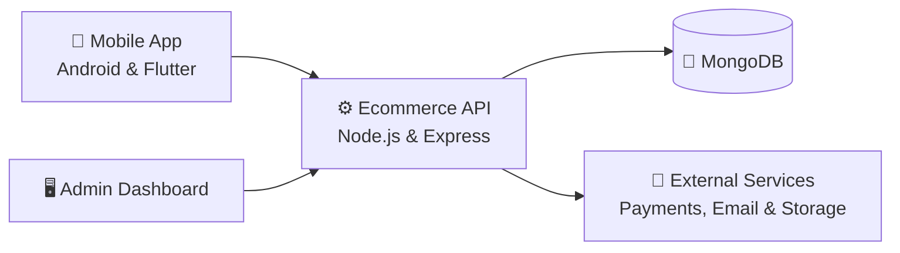

<div align="center">

# 🛒 Ecommerce API

### A production-minded ecommerce backend built while expanding from mobile engineering into full-stack development

[](https://nodejs.org/)
[](https://www.typescriptlang.org/)
[](https://expressjs.com/)
[](https://www.mongodb.com/)

[](#-roadmap)
[](#-my-learning-journey)
[](./package.json)

</div>

---

## ✨ Overview

This repository is the backend foundation for a complete ecommerce platform. It is being built with **Node.js, Express, TypeScript, MongoDB, Mongoose, and Zod**, with a focus on clean architecture, reliable validation, secure practices, and maintainable code.

The current version provides category and product management, a public product catalog with search, filtering, sorting, and pagination, request validation, centralized error handling, duplicate detection, relationship protection, and automatic slug generation.

> [!NOTE]
> This is an active learning project. Features are added progressively as I explore backend architecture and full-stack product development.

## 🎯 My learning journey

I am a **senior mobile application engineer** specializing in **native Android** and **Flutter** development. I created this project to deepen my backend and web development experience and grow into a **full-stack engineer** capable of designing and delivering complete products from end to end.

My goal is not to build only a standalone API. I am learning how to design an entire ecommerce ecosystem and connect all of its parts:

| Product | Purpose | Status |
| --- | --- | :---: |
| ⚙️ **Backend API** | Business logic, data, validation, security, and integrations | 🚧 In progress |
| 📱 **Mobile application** | Customer-facing shopping experience built by me | 🗓️ Planned |
| 🖥️ **Admin dashboard** | Store, product, category, order, and user management | 🗓️ Planned |

## 🧩 Platform vision



## 🚀 Current capabilities

- Category CRUD operations
- Product creation, listing, updating, and deletion
- Active product catalog with case-insensitive name search
- Product filtering by category, price range, and stock availability
- Product sorting by recency, price, and rating
- Category relationship validation and populated product responses
- Integer-based pricing in minor currency units
- Product stock and active-status management
- Protected category deletion when associated products exist
- Request validation with Zod
- Pagination with configurable page size
- MongoDB persistence through Mongoose
- Automatic category slug generation
- Centralized operational error handling
- Duplicate resource detection
- Development request logging
- TypeScript type safety
- Ready-to-import Postman collection

## 🛠️ Tech stack

| Area | Technology |
| --- | --- |
| Runtime | Node.js |
| API framework | Express 5 |
| Language | TypeScript |
| Database | MongoDB |
| ODM | Mongoose |
| Validation | Zod |
| Logging | Morgan |
| Development runner | TSX |

## 🏁 Getting started

### Prerequisites

- Node.js `20.19` or newer
- MongoDB locally or a MongoDB Atlas database

### Installation

1. Clone the repository:

   ```bash
   git clone https://github.com/mahdi-code007/ecommerce-api-typescript.git
   cd ecommerce-api-typescript
   ```

2. Install dependencies:

   ```bash
   npm install
   ```

3. Create your local environment file:

   ```bash
   cp .env.example config.env
   ```

4. Add your MongoDB connection string to `config.env`.

5. Start the development server:

   ```bash
   npm run dev
   ```

The API is available at `http://localhost:3000` by default.

## ⚙️ Environment variables

| Variable | Description | Example |
| --- | --- | --- |
| `PORT` | HTTP server port | `3000` |
| `NODE_ENV` | Runtime environment | `development` |
| `DATABASE_URI` | MongoDB connection string | `mongodb://127.0.0.1:27017/ecommerce` |

> [!IMPORTANT]
> Never commit `config.env` or any file containing real credentials. Use `.env.example` only as a safe configuration template.

## 📜 Available scripts

| Command | Description |
| --- | --- |
| `npm run dev` | Start the development server with automatic reload |
| `npm run typecheck` | Check TypeScript types without emitting files |
| `npm run build` | Compile the project into `dist/` |
| `npm start` | Run the compiled production build |

## 🔌 API reference

Base path: `http://localhost:3000/api/v1`

### Categories

| Method | Endpoint | Description |
| :---: | --- | --- |
| `GET` | `/categories` | List categories with pagination |
| `POST` | `/categories` | Create a category |
| `GET` | `/categories/:id` | Get a category by ID |
| `PATCH` | `/categories/:id` | Update a category |
| `DELETE` | `/categories/:id` | Delete a category |

The list endpoint accepts optional `page` and `limit` query parameters. The maximum page size is `100`.

A category that still has associated products cannot be deleted. The API returns `409 Conflict` until those products are removed or reassigned.

### Products

| Method | Endpoint | Description |
| :---: | --- | --- |
| `GET` | `/products` | Search, filter, sort, and paginate active products |
| `POST` | `/products` | Create a product linked to an existing category |
| `PATCH` | `/products/:id` | Update a product or move it to another category |
| `DELETE` | `/products/:id` | Delete a product |

The public catalog returns products where `isActive` is `true` and supports these optional query parameters:

| Parameter | Description |
| --- | --- |
| `search` | Case-insensitive partial match against the product name |
| `categoryId` | Filter by category ID |
| `minPrice` | Minimum `priceInMinorUnits` |
| `maxPrice` | Maximum `priceInMinorUnits` |
| `inStock` | Use `true` for products with stock or `false` for out-of-stock products |
| `sort` | `newest`, `price_asc`, `price_desc`, or `rating_desc` |
| `page` | Page number, starting from `1` |
| `limit` | Page size from `1` to `100` |

Example:

```http
GET /api/v1/products?search=phone&categoryId=507f1f77bcf86cd799439011&minPrice=100000&maxPrice=500000&inStock=true&sort=price_asc&page=1&limit=20
```

Product prices are stored in `priceInMinorUnits` as integers—for example, `125075` represents `1250.75` in the selected currency.

Product responses populate the related category's `name` and `slug`. Rating fields are controlled by the server and cannot be set directly through product creation or update requests.

## 🗂️ Project structure

```text
.
├── config/          # Database and application configuration
├── controllers/     # Request handlers and business operations
├── middlewares/     # Express middleware
├── models/          # Mongoose data models
├── postman/         # Postman API collection
├── routes/          # API route definitions
├── schemas/         # Zod validation schemas
├── types/           # TypeScript declaration extensions
├── utils/           # Shared utilities and error classes
├── app.ts           # Express application setup
└── server.ts        # Application entry point
```

## 🧭 Roadmap

- [x] Project foundation and TypeScript setup
- [x] Category management
- [x] Product catalog foundation
- [x] Product search, filtering, sorting, and pagination
- [x] Product-to-category relationships
- [x] Validation and centralized error handling
- [ ] Authentication and authorization
- [ ] User and address management
- [ ] Brands and subcategories
- [ ] Product variants and advanced inventory
- [ ] Product image upload and storage
- [ ] Wishlist and shopping cart
- [ ] Coupons and promotions
- [ ] Orders and checkout flow
- [ ] Payment gateway integration
- [ ] Reviews and ratings
- [ ] File and image storage
- [ ] Automated testing
- [ ] API documentation
- [ ] Deployment and continuous integration
- [ ] Mobile application integration
- [ ] Admin dashboard integration

## 🧪 Explore with Postman

Import [`postman/Ecommerce-API.postman_collection.json`](./postman/Ecommerce-API.postman_collection.json) into Postman to explore and test the available requests.

---

<div align="center">

### Built as part of my journey from senior mobile engineer to full-stack engineer

**Native Android · Flutter · Backend · Full Stack**

</div>
